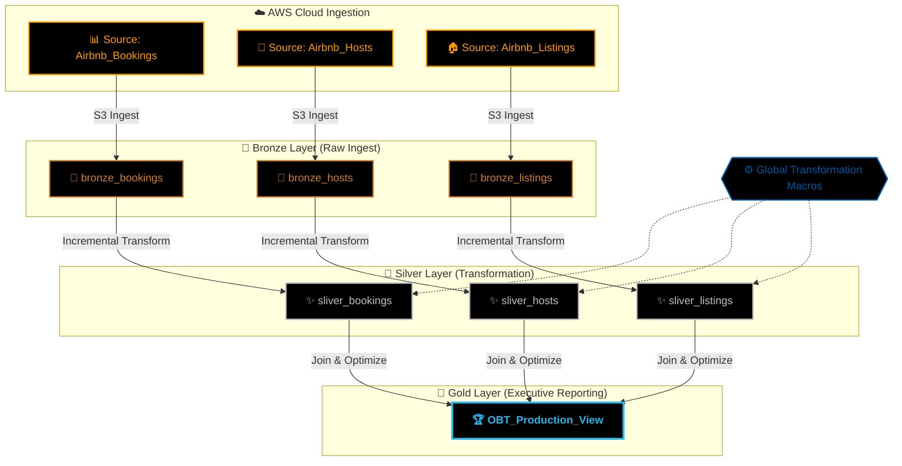
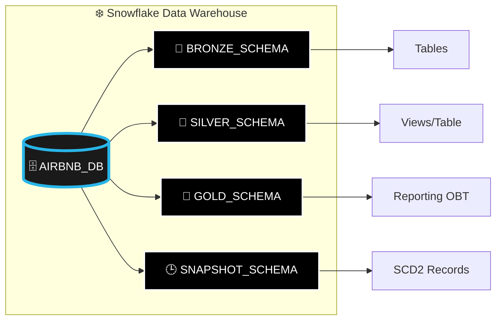
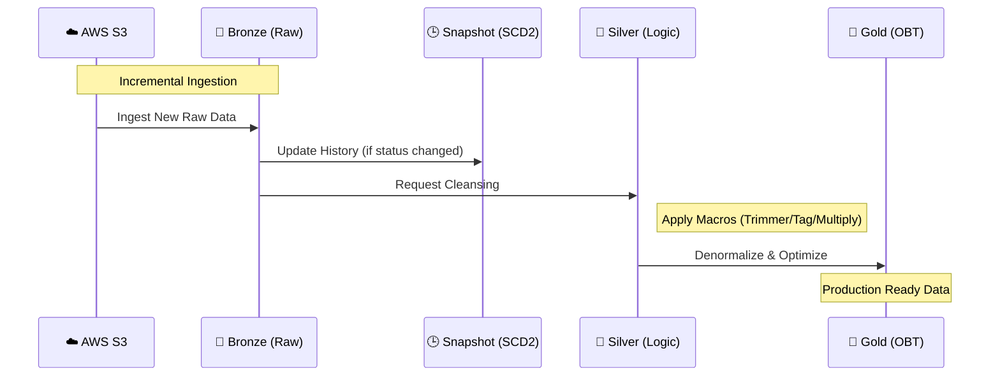

<div align="center">

# 💎 THE DATA REFINERY
### 🏔️ AWS x Snowflake x dbt: Enterprise Data Architecture


**A Principled Medallion Infrastructure for Modern Global Intelligence**

[](https://github.com/qayasmehtab/AWS_DBT_snowflake)
[](https://github.com/qayasmehtab/AWS_DBT_snowflake)
[](https://docs.getdbt.com/)
[](https://www.snowflake.com/)

---

[**Architecture Blueprint**](#-architecture--lineage) • [**Environment Map**](#-snowflake-environment-map) • [**Record Journey**](#-data-lifecycle--journey) • [**Governance**](#-security--governance) • [**Operations**](#-standard-operating-procedures-sops)

</div>

## 📖 Executive Summary
This repository implements an **Enterprise-Grade Reference Architecture** for building a high-performance Data Lakehouse. By strictly adhering to the **Medallion Architecture**, we transform raw, fragmented datasets from **AWS S3** into highly structured, validated, and enriched analytical assets within **Snowflake**. 

Orchestrated via **dbt**, this project serves as a cornerstone for data-driven organizations requiring a cost-optimized, high-integrity "Single Source of Truth."

---

## 🏛️ Project Pillars

<table width="100%">
  <tr>
    <td width="33%" align="center">
      <h3>🛡️ Data Reliability</h3>
      Test-driven development (TDD) with 16+ automated integrity checks.
    </td>
    <td width="33%" align="center">
      <h3>⚡ Performance</h3>
      Incremental strategies and Snowflake-optimized SQL for sub-second builds.
    </td>
    <td width="33%" align="center">
      <h3>📖 Transparency</h3>
      Full auto-generated catalog with column-level lineage and metadata.
    </td>
  </tr>
</table>

---

## 📐 Architecture & Lineage

Our data pipeline is engineered for linear scalability, utilizing **SCD Type 2 Snapshots** for permanent historical auditability.



---

## 🗺️ Snowflake Environment Map

Visualizing the logical structure of our Lakehouse within the **Snowflake Data Cloud**:



---

## 🔄 Data Lifecycle & Journey

The journey of a single record from arrival to decision:



---

## 📋 Data Governance Matrix

| Layer | Governance Strategy | PII Handling | Objective |
| :--- | :--- | :--- | :--- |
| **🥉 Bronze** | Schema Enforcement | Raw Storage | Auditability |
| **🥈 Silver** | Normalization & Macros | Anonymized Names | Business Logic |
| **🥇 Gold** | Aggregation & Join | Summary Only | Executive Reporting |

---

## 🛠️ Infrastructure Specifications

*   **Logic Orchestration**: dbt-core v1.11.2 (Latest Stable)
*   **Storage Tier**: AWS S3 (Staging Lake)
*   **Compute Tier**: Snowflake (Vectorized Execution Engine)
*   **Quality Gates**: 16+ Automated Unit & Schema Assertions
*   **Lineage Tracking**: SCD Type 2 Snapshots for permanent state history

---

## 🚀 Standard Operating Procedures (SOPs)

### Deployment Cycle
```powershell
# 1. Pipeline Synchronization
.venv\Scripts\Activate.ps1
dbt deps

# 2. Production Build Execution
dbt build --select +gold
```

---

## 🤝 Conclusion & Contact
This architecture represents the culmination of principled data engineering. It is designed for scale, built for reliability, and optimized for performance.

**"Data is the foundation; dbt is the masterpiece."** 🏔️✨

---
*Developed and Curated by **[Qayas Mehtab](https://github.com/qayasmehtab)** • [LinkedIn](https://www.linkedin.com/in/qayas-mehtab-6b834423b/)*
